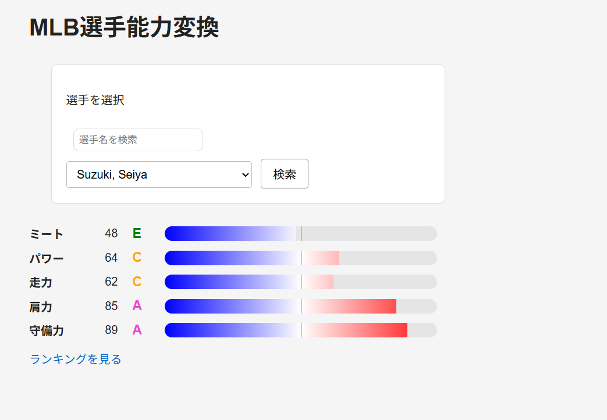
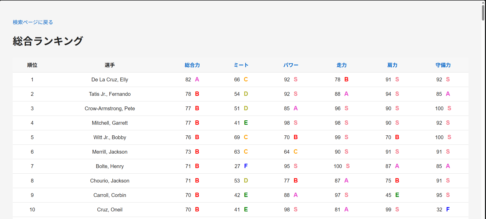

# MLB選手能力変換アプリ

MLBのStatcastデータを用いて、選手の能力をパワプロ風のパラメータに変換するWebアプリです。

## 概要

MLBのデータ集積サイトBaseball Savant上の各種指標を取得し、

- ミート
- パワー
- 走力
- 肩力
- 守備力

の5項目に変換して表示します。

また、独自指標として `Contact Efficiency` を定義し、既存指標である `Squared-Up%` と比較しています。

## スクリーンショット




## Contact Efficiency

Bat Speedから統計的に期待される平均打球速度と、実際の平均打球速度との差として定義しています。

バットスピードから期待される平均打球速度よりも実際の平均打球速度が高い場合、その打者はバットスピードを打球速度へ効率よく変換できていると考えます。

この能力は、ボールを強く正確に捉えるミート能力の一側面を表す可能性があると考えています。

### 指標を考案した背景

バッターのミート能力を考える際に利用できる既存指標として、Baseball Savant上に `Squared-Up%` があります。

Squared-Up%は、スイング速度や投球速度などから考えられる最大打球速度に対して、80%以上の打球速度を生み出した打球の割合を表す指標です。

この指標が高ければ、芯に当てて質の高い打球を多く生み出しているということになります。

しかし、Squared-Up%は一定の基準を超えた打球の「割合」で評価するため、常に80%の打球を生み出すバッターと、100%の打球と70%の打球を半分半分の割合で生み出すバッターとでは後者の方が低くされます。

これはアベレージヒッターとホームランバッターというスタイルの違いであり、バッターの優劣を計測する際には不適切であると考えます。
（パワプロ風に言えばミート多用と強振多用の違い）

そこで、打球ごとの一定基準を超えた割合ではなく、Bat Speedから統計的に期待される平均打球速度と実際の平均打球速度との差を利用することで、アベレージヒッターだけでなく、ホームランバッターも適切に評価できるのではないかと考え、Contact Efficiencyを定義しました。

## Contact EfficiencyとSquared-Up%の比較

2026年のデータを用いて、それぞれの指標とxwOBA percentileとのPearson相関係数を比較しました。

- Contact Efficiency: 0.579
- Squared-Up%: 0.047

2026年のデータでは、Contact Efficiencyの方がxwOBA percentileと強い正の相関を示しました。

なお、この結果は因果関係を示すものではなく、各指標とxwOBA percentileの関係の強さを比較したものです。

## 主な機能

- MLB選手の検索
- 選手能力のパワプロ風表示
- 能力値を0〜100の相対評価として表示
- 能力値バーによる可視化
- 総合ランキングの表示
- 各能力によるランキング並び替え
- Contact Efficiencyの算出
- Contact EfficiencyとSquared-Up%の比較分析

## 使用技術

### バックエンド

- Python
- Flask
- pandas
- scikit-learn
- pybaseball
- requests

### フロントエンド

- HTML
- CSS
- JavaScript

## ファイル構成

```text
.
├── app.py
├── baseball_stats.py
├── machine_learning.py
├── requirements.txt
├── static
│   └── style.css
└── templates
    ├── index.html
    └── rank.html
```

### app.py

FlaskによるWebアプリ本体です。

選手の選択、能力値の算出、ランキングの作成、HTMLへのデータ受け渡しを行います。

### baseball_stats.py

Baseball Savantから取得したデータを、パワプロ風の能力値へ変換する処理をまとめています。

### machine_learning.py

scikit-learnを用いてContact Efficiencyを算出し、既存指標との比較分析を行います。

## 実行方法

### 1. リポジトリを取得

```bash
git clone https://github.com/ishidaken0108-sketch/mlb-pawapuro-ability-app.git
cd mlb-pawapuro-ability-app
```

### 2. 必要なライブラリをインストール

```bash
pip install -r requirements.txt
```

### 3. アプリを起動

```bash
python app.py
```

起動後、ブラウザから以下へアクセスします。

```text
http://127.0.0.1:5000
```

## 今後の改善

- 選球眼を評価する独自指標の追加
- 複数年度を用いた独自指標の検証
- UIの改善
- 独自指標の分析方法の拡張

## AIの使用範囲

本アプリは、Python・Flask・HTML・CSS・JavaScriptの学習を目的の一つとしており、実装は基本的に自分で調べながら行いました。

AIは、理解できないコードや実装方法について質問する補助的な用途に使用していますが、コード生成を主体とした開発は行っていません。

使用したコードについては、処理内容を確認し、自分で説明・修正できる状態で実装しています。